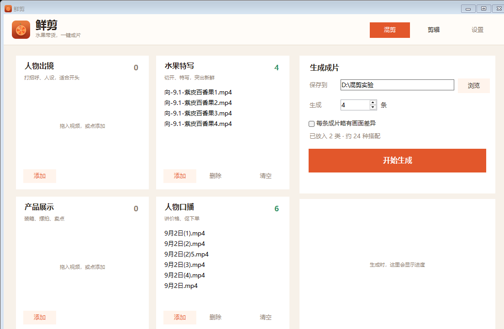

# 鲜剪

水果带货一键混剪。放入人物出镜、水果特写、产品展示、人物口播，自动搭配结构并生成竖屏成片。



## 下载软件

1. 打开 [Releases](https://github.com/littlexx15/xianjian/releases) 下载 `鲜剪-windows.zip`
2. 解压后，把 `ffmpeg.exe` 和 `ffprobe.exe` 放到同一目录（[FFmpeg 下载](https://www.gyan.dev/ffmpeg/builds/)）
3. 双击 `鲜剪.exe`

也可以直接下载仓库里的 [`dist/鲜剪.exe`](dist/鲜剪.exe)，同样需要旁边放上模块文件和 FFmpeg。

## 用法

1. 把视频拖进四个格子，或点「添加」
2. 选保存位置和条数
3. 点「开始生成」
4. 需要删一段时，切到「剪辑」：拖到位置 → 切开 → 删掉不要的片段 → 导出

至少放两类素材。只有一类时，程序会再确认一次。成片尺寸和音量在右上角「设置」。

## 运行要求

- Windows 10 / 11
- Windows PowerShell 5.1（系统自带）
- FFmpeg（建议同时提供 `ffprobe.exe`）

源码方式：把 `ffmpeg.exe` 放到程序目录，双击 `启动鲜剪.cmd`。

## 主要能力

- 四类素材：人物出镜、水果特写、产品展示、人物口播
- 先选跨类模板，再轮换具体素材；模板顺序固定
- 时长范围仅供参考，不截断原片，不按上下限排除组合
- 单条内不重复文件
- 两遍 `loudnorm` 响度统一
- 成品预览、分割、删段、重新导出

## 测试

```powershell
powershell.exe -NoProfile -ExecutionPolicy Bypass -File .\tests\MixerCore.Tests.ps1
powershell.exe -NoProfile -ExecutionPolicy Bypass -File .\tests\TemplatePlanner.Tests.ps1
powershell.exe -NoProfile -ExecutionPolicy Bypass -File .\tests\GuiConstruction.Tests.ps1
```

## 固定组合模板

1. 人物出镜 → 产品展示 → 人物口播
2. 人物出镜 → 人物口播
3. 人物出镜 → 产品展示
4. 产品展示 → 人物口播
5. 水果特写 → 产品展示 → 人物口播
6. 水果特写 → 产品展示
7. 水果特写 → 人物口播
8. 人物出镜 → 水果特写 → 产品展示 → 人物口播
9. 人物出镜 → 产品展示 → 人物口播 → 水果特写
10. 人物出镜 → 产品展示 → 水果特写

每个类别选一个完整视频。只有两个钩子类别时，补充「人物出镜 → 水果特写」。
